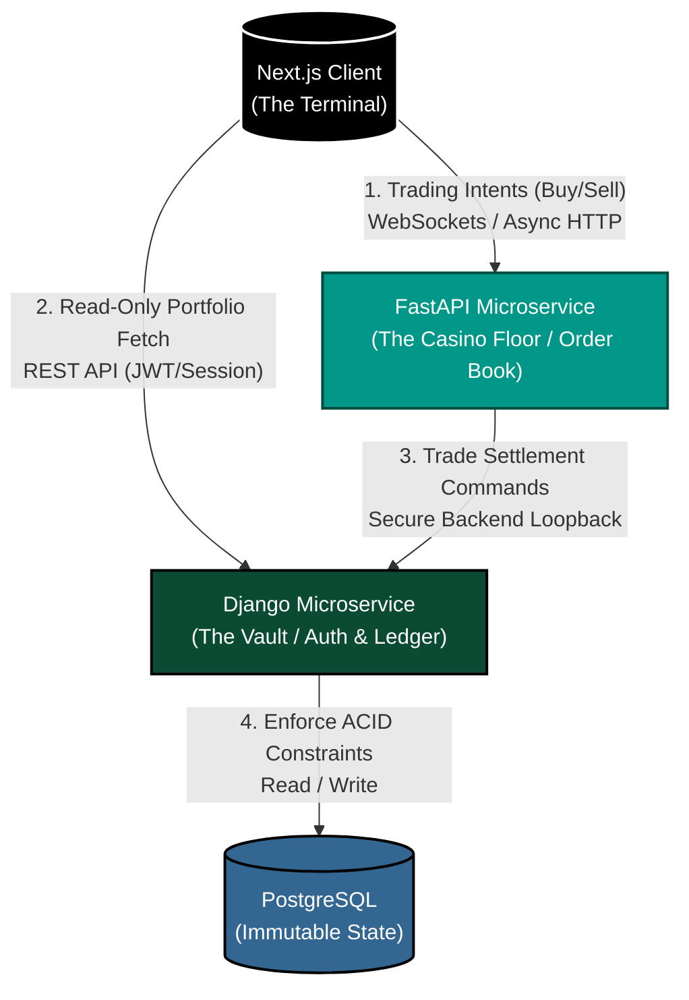

# Project-Mitori
A microservice-based stock brokerage platform and order book analytics engine

### What is this?
Project Mitori is a custom-built stock trading platform I am developing from scratch. The goal is to learn how real financial systems work under the hood. 

### Bird's Eye View of the project
Mainly i intend to create a custom build stock trading application, with various technologies and architectural approaches , observing trade-offs and critically analyzing the choices of what create a real enterprise application.



### Tech stack

### Tech stack
* Django for auth and maintaining the certain data in the database which will be postgresql
* FastApi for simulating the real order book and matching orders in real time.
* Nextjs for the frontend and for polished Ui
__That is the major stack for this application__
### Architectural Approach
* Architectural approach for this project Mitori would be maintaing the modularity of the technologies leveraging the best pieces of every framework weighing trade offs and chosing the best optimal solution that mimics an enterprise application.
__In short a polyglot architecture which is highly decoupled , leveraging the solidity of Django , blazing fastness of FastApi and Rendering techniques of Nextjs__

### Expected Outcome
* What i am aiming for at the end of this project is that I not only implement and levitate this application to production grade enterprise application but also derive some insights about the thoughts and questions i am having and that question is 
__Is leveraging c++ in such a decoupled polyglot architecture going to decrease the latency of the matched orders in the fastapi or is it not worth the complexity?__
### Network vs Execution Paradox
Though it is clear that c++ can match order book in nanosecond because of it's speed and compatibility with the machine level the main point of observation would be cross-process communication overhead, will it consume more time than the raw python script? 

This will surely be answered by the end of Project Mitori

This README serves as my daily development log.

---

### What I've Built So Far

### Django (The backend Monster)
* I am tackling Django head on first, Django will serve as the locker room or the ultimate lock for our data, we will use django mainly for:
* Custom Authentication
* Django comes with built ini support for several databases and postgresql is one of them we need that because it will be a dataextensive application and we need to have a framework that is proven the test of time , has strong policies , data integrity policies and out of the gate security for everything an enterprise application is supposed to encounter

**1. Secure Authentication**
* Ripped out Django's default username system.
* Built a custom User model (`AbstractBaseUser`) that uses Email and Password as the primary login, matching modern app standards. Only email is being used as of right now.


**2. The Financial Ledger Architecture**
__core_Ledger__ is the secured vault of our application
Since django is for the absolute data integrity we can not leave any loophole in our safe that guards the data.
__models.py__
    * Portfolio Table has one to one relation with the user table.
    * Position table has one to many relationship with Portfolio table.
    * LedgerTransaction table has one to many relation with Portfolio table.
    
Django Rest Frame work would be required for serving of data from the backend to the frontend. After the installation of drf we create serializers.py file which will hold the serialization logic for our django microservice.
__serializers.py__
* PortfolioSerializer and PositionSerializers are instructions to django rest framework what fields to expose to api.
* The most interesting part is LedgerSerialization because it forces us to ask the question what if the user sent a post request from the front end mimicking someone else and registered a transaction , if we had followed the basic path of not validating the incoming data we would be exposing ourselves to the hackers they can forge their identity pretending to be someone else and make transactions. 
When a request hits the api endpoint even before reaching the serialzer django views it , middleware process it reads the HTTP Cookie or JWT Token and attaches verified user to request object we leverage that by running 
```
    request = self.context.get('request')
```
By looking at this we are not inspecting the api request we are reading the encrypted session that will tell us either if this user is trying to impersonate someone or not.

__views.py__
If models are our tables then views is where we make the magic work , map how the requests hitting our servers be served.
__IDOR(Insecure Direct Object Reference)__ There are high chances of a person trying to impersonate someone sending requests as someone else and reading data that he is not authorized to see , we fix that again by looking at the session id and getting to the root of the request , locking that a person should only see the portfolio , positions and transaction he is supposed to see.
I used generic views  in accordance with the relationship each of our model have with the user. and then finally the query is run on the database that will give the user only and only it's data.

__urls.py__
Finally i incorporate these views with the url to make the api endpoints fully functional and responding and top them off by running fresh makemigrations and migrate.

__One Note : before I wrap this django implementation is there are still several things that are still to be implemeneted , I have just laid the ground work for the project , that will be leveraging several technologies , moving away from cohesive or monolithic structures and dwelling into the decoupled land of architecture, all of the unfinished features will be fully implmented once the flow of the project is somewhat complete__

__That flow is Django -> FastApi -> Nextjs__

### Future Improvements in Django microservice
* [ ] Solving Race condition
* [ ] implementing JWT (I will tackle this in Nextjs section)
* [ ] Implementing Logger
* [ ] DDOS attack
* [ ] Testing
* [ ] Implementing KYC properly
* [ ] Proper email verification workflow

__when i'll be patching these loopholes i'll refernce this readme in the commit and i'll also be tagging it in what commit this certain improvements where made__