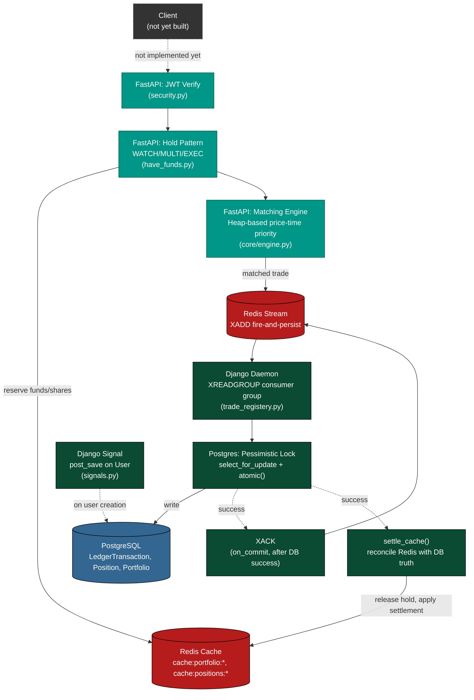

# Project-Mitori
A microservice-based stock brokerage platform and order book analytics engine

### What is this?
Project Mitori is a custom-built stock trading platform I am developing from scratch. The goal is to learn how real financial systems work under the hood. 

### Bird's Eye View of the project
Mainly i intend to create a custom build stock trading application, with various technologies and architectural approaches , observing trade-offs and critically analyzing the choices of what create a real enterprise application.



### Tech stack

### Tech stack
* Django for auth and maintaining the certain data in the database which will be postgresql
* FastApi for simulating the real order book and matching orders in real time.
* Nextjs for the frontend and for polished Ui
__That is the major stack for this application__
### Architectural Approach
* Architectural approach for this project Mitori would be maintaing the modularity of the technologies leveraging the best pieces of every framework weighing trade offs and chosing the best optimal solution that mimics an enterprise application.
__In short a polyglot architecture which is highly decoupled , leveraging the solidity of Django , blazing fastness of FastApi and Rendering techniques of Nextjs__

### Expected Outcome
* What i am aiming for at the end of this project is that I not only implement and levitate this application to production grade enterprise application but also derive some insights about the thoughts and questions i am having and that question is 
__Is leveraging c++ in such a decoupled polyglot architecture going to decrease the latency of the matched orders in the fastapi or is it not worth the complexity?__
### Network vs Execution Paradox
Though it is clear that c++ can match order book in nanosecond because of it's speed and compatibility with the machine level the main point of observation would be cross-process communication overhead, will it consume more time than the raw python script? 

This will surely be answered by the end of Project Mitori

This README serves as my daily development log.

---

### What I've Built So Far

### mitori_backend (The backend)
* I am tackling Django head on first, Django will serve as the locker room or the ultimate lock for our data, we will use django mainly for:
* Custom Authentication
* Django comes with built ini support for several databases and postgresql is one of them we need that because it will be a dataextensive application and we need to have a framework that is proven the test of time , has strong policies , data integrity policies and out of the gate security for everything an enterprise application is supposed to encounter

**1. Secure Authentication**
* Ripped out Django's default username system.
* Built a custom User model (`AbstractBaseUser`) that uses Email and Password as the primary login, matching modern app standards. Only email is being used as of right now.


**2. The Financial Ledger Architecture**
__core_Ledger__ is the secured vault of our application
Since django is for the absolute data integrity we can not leave any loophole in our safe that guards the data.
__models.py__
    * Portfolio Table has one to one relation with the user table.
    * Position table has one to many relationship with Portfolio table.
    * LedgerTransaction table has one to many relation with Portfolio table.
    
Django Rest Frame work would be required for serving of data from the backend to the frontend. After the installation of drf we create serializers.py file which will hold the serialization logic for our django microservice.
__serializers.py__
* PortfolioSerializer and PositionSerializers are instructions to django rest framework what fields to expose to api.
* The most interesting part is LedgerSerialization because it forces us to ask the question what if the user sent a post request from the front end mimicking someone else and registered a transaction , if we had followed the basic path of not validating the incoming data we would be exposing ourselves to the hackers they can forge their identity pretending to be someone else and make transactions. 
When a request hits the api endpoint even before reaching the serialzer django views it , middleware process it reads the HTTP Cookie or JWT Token and attaches verified user to request object we leverage that by running 
```
    request = self.context.get('request')
```
By looking at this we are not inspecting the api request we are reading the encrypted session that will tell us either if this user is trying to impersonate someone or not.

__views.py__
If models are our tables then views is where we make the magic work , map how the requests hitting our servers be served.
__IDOR(Insecure Direct Object Reference)__ There are high chances of a person trying to impersonate someone sending requests as someone else and reading data that he is not authorized to see , we fix that again by looking at the session id and getting to the root of the request , locking that a person should only see the portfolio , positions and transaction he is supposed to see.
I used generic views  in accordance with the relationship each of our model have with the user. and then finally the query is run on the database that will give the user only and only it's data.

__urls.py__
Finally i incorporate these views with the url to make the api endpoints fully functional and responding and top them off by running fresh makemigrations and migrate.

__One Note : before I wrap this django implementation is there are still several things that are still to be implemeneted , I have just laid the ground work for the project , that will be leveraging several technologies , moving away from cohesive or monolithic structures and dwelling into the decoupled land of architecture, all of the unfinished features will be fully implmented once the flow of the project is somewhat complete__

__That flow is Client(Frontend)->Mitori Engine(FastAPI - Validate with Redis Cache ,Lock+match)->Redis Stream->Django Daemon(Custom Manager for trade settelment in database) -> Postgres(the source of ultimate trade history and portfolio) ->Redis Stream__

### Future Improvements in Django microservice
* [x] Solving Race condition (solved when implementing cache and Custom Management Command for django daemon | it is solved in multiple commits) [First Commit](https://github.com/Har1s-Akbar/Project-Mitori/commit/bfa18f4acf73c49252229f8dee6747a4d1448d5f) - [Last Commmit] (https://github.com/Har1s-Akbar/Project-Mitori/commit/ba129131c2ec9f6df374d26bc98f10b9c13dbc6b) 
* [x] implementing JWT (fixing patch 1.1) [First commit](https://github.com/Har1s-Akbar/Project-Mitori/commit/f69618e2c29c0372cacf15b1b26a53f00b901e01) - [Last commit](https://github.com/Har1s-Akbar/Project-Mitori/commit/c52506520e7ae70505bef895a2c76c26e264fd93)
* [ ] Implementing Logger
* [ ] DDOS attack
* [ ] Testing
* [ ] Implementing KYC properly
* [ ] Proper email verification workflow

__when i'll be patching these loopholes i'll refernce this readme in the commit and i'll also be tagging it in what commit this certain improvements where made__

### mitori_engine (The Engine)
We need FastApis for out matching engine , Instead of frontend reaching out to backend django everytime we have an order we do not reach out to our backend django and register it.
Because in a high frequency system like this there can be certain situations
* Order stays hanging , is not filled.
* Order is canceled after a certain time.
* Order is edited and replaced.
As a System Engineer you have to look at what you want your application to do and how the user is going to use it.
* An order is an intent it is not certain until it is matched and filled.
* A trade after the match is certain.
We do not want any uncertainity in our database , we only want facts and data that is certain , so nothing gets past our django until we know it is not an intent it is a fact.

keeping that architecture in mind we design our matching engine.

we define the folder structure of the project.

    mitori_engine
        ->core
            ->__init__.py
            -> engine.py
            -> models.py
        main.py
        requirements.txt

mitori_engine will be our main directory where we will be implementing our engine.
core will be the directry that will house engine and models.
main.py is our file that will have configuered routes for our api.

**1. core**
* As the name suggests core holds the core functionality of our FastApi engine.
it houses two files
*models (Memory Optimization)*
* In models we deal with the problem of memory and speed.
if we chose normal class with dict overhead in it we will be trading off pure speed and memory with ease of use.
since it is a systems level question and we have to look at it from that perspective we need to know what our system will be doing , our system will be handling thousands of request in such a case normal , generic class will bloat our memory and will make our
engine slow __which is the thing we are trying to avoid__ because hypothetically our engine will be dealing with great number of requests.
To make our engine fast we will strip the python class from it's under the hood dict which will transform python class into collection of only necessary things we want
* dataclass
* slot
python provides these option so that we can remove underhood dict from the class and give us speed and memory saving.

**2. engine (Matching core)**
* Engine will be the place where we will create our matching engine.
we will take advantage of the heap data structure of the python for this purpose, we will be creating priority queue strictly based on metrics that, the priority will be given to the order that is 
* price
* date_time
* order_id
we want the best price according to our criteria to be on the top of the heap, if we get two orders with equivalent price then we move on to our next priority criteria  which is the time , in our order we have the time explicitly calculated at the time of the order.
this covers our  priority criteria.
Now the architecture of the order book we wil have

    Order Book
        ->buy side list
        ->sell side list
        ->ticker

when a user would be requesting to buy or sell a certain stock , ticker will be included in that request and based on that ticker we will chose which order book we want the order to be directed to based on the ticker.

* buy side 
    buy side will be a max heap with the highest price at the top
*sell side
    sell side  will be a min heap with lowest price on the top


**3. main**
In the main we implement
* pydantic model for mainatining data integrity of the data received from the user request.
* maintaining the record for markets so that no malicious user can create another order book with script injection.
* route configuration and making sure that engine is running

### Future Improvements in engine microservice
* [ ] Tombstone Cancellation
* [ ] Partial refill injection into heap
* [ ] MultiWorker scaling for the offered Market
* [ ] Idempotency Protection
* [ ] Write ahead log
* [ ] Cryptographic Ownership for the order

### Streamin Bridge (Fire and persist)
Now we introduce Redis not because it is a fancy software that every production grade application uses but because there is a certain need that we have for redis in our decoupled system.
You might ask what that need might be why did i chose redis stream instead of standard HTTP call between django and fastapi
**Need for Redis**
We need the matched order to be delivered to our django system so that our django can handle that data and update database as well as perofrm services as well.
You might say why redis and why not standard HTTP Request.
* Standard HTTP request breaks the system and purpose of high frequency , standard HTTP would make fastapi pause and divert from it's pupose which is only matching order and validating the user  before the allowing the user to trade.
* Every HTTP request needs a response , if  fastAPI talks with django directly , it will require the response of Djnago before severing the request and we need django to take the data and update the database , database operations are time expensive. This will make our HTTP request extremely slow and FastApi will miss orders which is the whole point for us choosing the redis stream.

There is another architectural nuance here I could have gone with redis pub/sub but i chose streams which follows the pattern of fire and persist.
**Pub/Sub**
Pub/Sub is an architectural structure where there is one publisher and number of services can subscribe to that publisher , and can implement other services based on the action publisher publishes in a channel , but there is a critical flaw that will make our system choke. ***Pub/Sub is fire and forget , it fires the data or action and it is not concerned with the acknowledgement of the subsctriber*** If for some reason our django service is down , instead of retaining the data in stream that data is lost on djangos end. When django service rebots it will not be able to see the traades it missed causing serious disruption in the system.

That made me chose the streams over pub/sub. Which are Fire and persist , until the group that is listening to the specific stream sends an ***ACKX*** redis stream maintains those messages as new for the group.

For the code implementation of redis stream you can check the commits below as well beaware the redis stream is implemented along side jwt bearer token authentication and django custom commands, so you might have to jump around to find what you are really looking for.
[ First Commit ](https://github.com/Har1s-Akbar/Project-Mitori/commit/ce991985e569dad631f376a8aa7554f381942e8e)

### Implementation
The way i configuered Redis stream is using a pool of connection. This is also an architectural decision. I chose connection pool over standard connection request of redis is because , In High Frequency systems if fastApi our matching engine stalls for sometime to open  a new connection with fastApi everytime a  new order is matched it would be desasterous because opening a connection and then properly closing it takes too much time. So i configuered the connection pool with the number of ***max_connections=15,*** it will make sure 15 connections are already open and everytime fastapi needs  to push a message into the stream it just grabs a connection connects to it , this saves us considerable of time on our request side.
Along side it I used the Lifespan to manage the global connection pool so that fastapi starts the connection pool everytime the server starts and also gracefully handles it when it's time to close.
along side the connection pool and lifespan events i also used depenedency injection so that each request that our ***/order*** route servers has redis.redis instance attached to it.

___Finally the choice of implementing appache kafka was alsso present , but i did not chose that route because , first of all apache kafka is for enterprise applications that are managing millions top hundred-millions data per second plus at this point if i were to implement apache kafka i would be over engineering the project , which is the biggest pifall you want to avoid__

# JWT Implementation
As i mentioned in the django section before  JWT is something that is for future improvements but when i started building this project I found it the absolutely necessary to implement the jwt auth because of sevaral reasons
* I need to know if the one who is putting the trade is authorized to do so?
* What if the person is just trying to corrupt the database? 
*How will the order be linked if there is not id being passed around from django to fastapi and back to django when it was time for settlement of the data.

These quesstions made me add jwt before proceeding any further and also they influenced other features and security implementations in the project as well.

**Implementation**
Now as always there were two to three choices for me when it comes to auth
* Handling auth at Fastapi
* Handling at Django
* Hadling auth using third party service

I chose Handling auth at django using djangorestframework-simplejwt, I will tell you the reason for it as well , It was because using fastapi would make me do extra things like
* Storing auth sessions in django (for that per login i would have to request to django saving the session)
* Django would have to verufy the data against fastapi everytime a user would put a request

I solved it by managing the auth at django which was easier than expected as i was able to get it running with customized options for token.

You can see the implementation for jwt here 
[First Commit](https://github.com/Har1s-Akbar/Project-Mitori/commit/1033b34218c429f67be6f038027ce83e90bf195f) - [Last Commit] (https://github.com/Har1s-Akbar/Project-Mitori/commit/c52506520e7ae70505bef895a2c76c26e264fd93)

