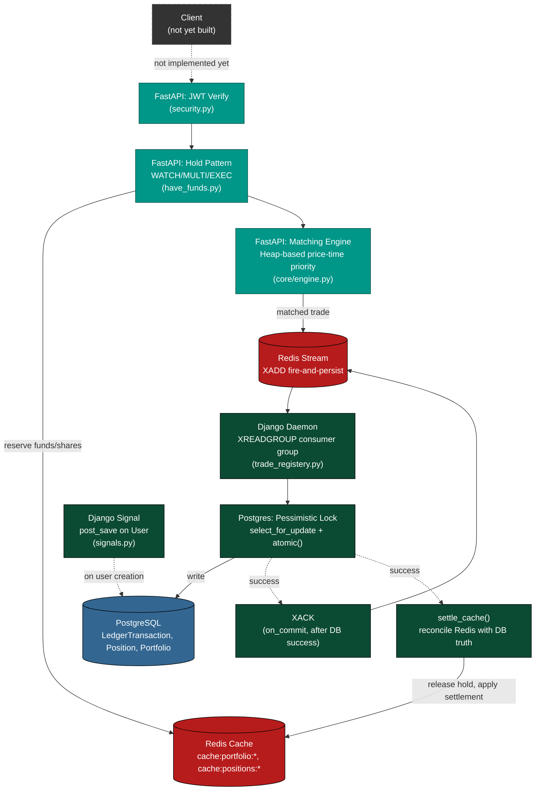

# Project Mitori

A decoupled, polyglot stock brokerage platform and order-book matching engine, built from scratch to understand how real trading infrastructure works under the hood — and to answer one specific question: **does rewriting the matching core in C++ actually reduce latency once you account for cross-process communication overhead, or does the network cost eat the gain?**

Started July 6, 2026. Actively developed daily since.

## Table of contents
- [Overview](#overview)
- [Architecture at a glance](#architecture-at-a-glance)
- [The research question](#the-research-question--network-vs-execution-paradox)
- [Tech stack](#tech-stack)
- [mitori_backend — Django](#mitori_backend--django)
- [mitori_engine — FastAPI](#mitori_engine--fastapi)
- [The Redis streaming bridge](#the-redis-streaming-bridge)
- [Redis cache & the hold pattern](#redis-cache--the-hold-pattern)
- [JWT authentication](#jwt-authentication)
- [Observability](#observability)
- [Testing](#testing)
- [Dockerization & CI/CD](#dockerization--cicd)
- [Running it locally](#running-it-locally)
- [Roadmap](#roadmap)

---

## Overview

Project Mitori is a custom-built stock trading platform. The goal isn't to ship a product — it's to build every layer of a real brokerage system myself: matching engine, ledger, settlement, caching, auth, observability, and eventually a performance comparison between a Python and a C++ matching core. Each architectural decision below was chosen deliberately, with the alternatives I considered and rejected written out, because the reasoning is the actual point of this project.

## Architecture at a glance


```mermaid
graph TD
    Client["Client<br/>(not yet built)"]
    Auth["FastAPI: JWT Verify<br/>(security.py)"]
    Hold["FastAPI: Hold Pattern<br/>WATCH/MULTI/EXEC<br/>(have_funds.py)"]
    Engine["FastAPI: Matching Engine<br/>Heap-based price-time priority<br/>(core/engine.py)"]
    Stream[("Redis Stream<br/>XADD fire-and-persist")]
    Daemon["Django Daemon<br/>XREADGROUP consumer group<br/>(trade_registery.py)"]
    Lock["Postgres: Pessimistic Lock<br/>select_for_update + atomic()"]
    DB[("PostgreSQL<br/>LedgerTransaction, Position, Portfolio")]
    Ack["XACK<br/>(on_commit, after DB success)"]
    Settle["settle_cache()<br/>reconcile Redis with DB truth"]
    Cache[("Redis Cache<br/>cache:portfolio:*, cache:positions:*")]
    Signal["Django Signal<br/>post_save on User<br/>(signals.py)"]

    Client -. "not implemented yet" .-> Auth
    Auth --> Hold
    Hold -- "reserve funds/shares" --> Cache
    Hold --> Engine
    Engine -- "matched trade" --> Stream
    Stream --> Daemon
    Daemon --> Lock
    Lock -- "write" --> DB
    Lock -. "success" .-> Ack
    Ack --> Stream
    Lock -. "success" .-> Settle
    Settle -- "release hold, apply settlement" --> Cache

    Signal -. "on user creation" .-> DB

    style Client fill:#333,stroke:#888,stroke-dasharray: 5 5,color:#fff
    style Auth fill:#009688,stroke:#004d40,color:#fff
    style Hold fill:#009688,stroke:#004d40,color:#fff
    style Engine fill:#009688,stroke:#004d40,color:#fff
    style Stream fill:#b71c1c,stroke:#000,color:#fff
    style Daemon fill:#0c4b33,stroke:#000,color:#fff
    style Lock fill:#0c4b33,stroke:#000,color:#fff
    style DB fill:#336791,stroke:#000,color:#fff
    style Ack fill:#0c4b33,stroke:#000,color:#fff
    style Settle fill:#0c4b33,stroke:#000,color:#fff
    style Cache fill:#b71c1c,stroke:#000,color:#fff
    style Signal fill:#0c4b33,stroke:#000,color:#fff
```

Everything on this diagram runs inside Docker with health-checked startup ordering, is covered by unit and integration tests, traced end-to-end with correlation IDs, and verified on every push by CI. Those four pieces are cross-cutting rather than boxes on the flow, so they're covered as their own sections below rather than crammed into the diagram.

## The research question — Network vs Execution Paradox

C++ can match orders on the order of nanoseconds thanks to its speed and closeness to the machine. That much isn't in question. What's actually in question is whether that speedup survives being embedded in a decoupled, polyglot system: does cross-process communication overhead consume more time than a raw Python matching loop saves?

Project Mitori exists to answer that with real numbers, not intuition — baseline Python latency measured first, then a C++ rewrite of the matching core measured the same way, with the comparison written up as a short research report. That work is in progress; the methodology document is scaffolded at [`docs/RESEARCH.md`](docs/RESEARCH.md).

## Tech stack

- **Django + Django REST Framework** — the system of record. Custom auth, the financial ledger, and the settlement daemon live here, because this is the layer that needs Postgres's transactional guarantees and Django's maturity around data integrity.
- **FastAPI** — the matching engine. Chosen for raw throughput and native `async` support, since this layer's only job is validating and matching orders as fast as possible.
- **PostgreSQL** — the durable source of truth for every trade, position, and portfolio balance.
- **Redis** — two distinct roles, kept architecturally separate: a **Stream** for fire-and-persist delivery of matched trades from FastAPI to Django, and a **cache** for the funds/shares hold pattern that lets FastAPI check solvency without touching Postgres on every order.
- **Docker + Docker Compose** — full local orchestration with health-checked, dependency-ordered startup.
- **GitHub Actions** — CI running both test suites against real Postgres and Redis service containers on every push.
- **structlog + orjson** — structured, correlation-ID-tagged logging across both services.
- **Next.js** — planned for the frontend; not yet built (see [Roadmap](#roadmap)).

**In short: a highly decoupled polyglot architecture** — Django's solidity for the ledger, FastAPI's speed for matching, Redis as the connective tissue between them, and (eventually) C++ as the answer to the research question above.

---

## mitori_backend — Django

Django is the vault. Its job is data integrity, not speed: custom authentication, the financial ledger, and the daemon that commits matched trades into Postgres with full transactional safety.

### Secure authentication

Django's default username-based auth was ripped out entirely in favor of a custom `AbstractBaseUser` model using email and password — matching how modern applications actually authenticate users.

> Commits: [`6fb1e0b`](https://github.com/Har1s-Akbar/Project-Mitori/commit/6fb1e0b433bb5dc2928479c8d0e7b432f2769042) → [`bbeb1ce`](https://github.com/Har1s-Akbar/Project-Mitori/commit/bbeb1ce7fe6f7300e67bbab4cc36e405f75c5f44)

### The financial ledger

`core_ledger` is the secured vault inside the vault. Three models, deliberately related:

- `Portfolio` — one-to-one with `User`
- `Position` — one-to-many with `Portfolio`
- `LedgerTransaction` — one-to-many with `Portfolio`

**Serializer-level identity protection.** `LedgerSerializer` doesn't trust anything the client claims about identity. Before Django REST Framework ever sees the request body, middleware has already read the JWT and attached a verified user to the request object. Every serializer reads that verified identity via `self.context.get('request')` rather than trusting client-supplied fields — the difference between reading an encrypted session and trusting a form field a client could forge.

**IDOR protection at the view layer.** Every view is scoped through the authenticated user's own relationships (`Portfolio` → `Position`/`LedgerTransaction`), so a query can only ever return data the requesting user is entitled to see — there's no code path where the database is queried by a client-supplied ID without that ID being derived from the authenticated session first.

> Commits: [`6fb1e0b`](https://github.com/Har1s-Akbar/Project-Mitori/commit/6fb1e0b433bb5dc2928479c8d0e7b432f2769042) → [`bbeb1ce`](https://github.com/Har1s-Akbar/Project-Mitori/commit/bbeb1ce7fe6f7300e67bbab4cc36e405f75c5f44)

### Django daemon — trade settlement

Once FastAPI matches an order and pushes it onto a Redis stream, something on the Django side has to pick it up, flatten it out of Redis's wire format, and commit it as fact. That's `trade_registery.py` — a Django custom management command that runs as a long-lived daemon via `XREADGROUP`.

**Why synchronous, not async, on this side.** FastAPI's Redis connection is async; Django's is deliberately synchronous. If the daemon settled multiple trades from the same portfolio concurrently, one trade's settlement could race against another's on the same portfolio row — exactly the kind of half-applied state a ledger can't tolerate. Settling one trade at a time, with full authority over that trade, removes the race entirely.

**Atomicity and locking.** Every settlement runs inside `transaction.atomic()` with `select_for_update` (pessimistic locking) on the affected rows — either the entire trade lands in Postgres or none of it does, and no other process can touch the same row mid-settlement. Only after the transaction actually commits does an `on_commit` hook fire `XACK` back to Redis, removing the message from the pending list. If the process crashes before that hook runs, the message simply stays in the stream for the daemon to pick up again on restart — nothing is lost.

> Commits: [`821cfa5`](https://github.com/Har1s-Akbar/Project-Mitori/commit/821cfa5b9f30ebc8b1ae3c6faaa69079531631de) → [`07802b1`](https://github.com/Har1s-Akbar/Project-Mitori/commit/07802b1b65fdfb838fdf80dc66c36cd67ec4b6a9)

### Idempotency protection

`XACK` guarantees the *stream* won't redeliver a message once it's acknowledged — but it doesn't protect against the daemon itself retrying a settlement after a partial failure, or a redelivered message on daemon restart. That's a separate, real failure mode: at-least-once delivery, which needs to become exactly-once *effect*.

The fix is a unique constraint on `stream_order_id` at the database level. If the daemon ever attempts to settle the same trade twice, the second attempt raises `IntegrityError` and is caught and discarded rather than double-crediting or double-debiting a portfolio. This is enforced by the database, not application logic — the one guarantee that can't be bypassed by a bug elsewhere in the call path.

> Commits: [`426aae4`](https://github.com/Har1s-Akbar/Project-Mitori/commit/426aae4d6475781ce7e799030f45606e71c0b3f6) → [`67f905f`](https://github.com/Har1s-Akbar/Project-Mitori/commit/67f905fe409739dd15105e4d050051da76246f55)

### Fixed-point precision

Money and share quantities are handled as fixed-point integers end-to-end, via a system-wide `SYSTEM_PRECISION_MULTIPLIER`, rather than native floats or even `Decimal` passed around loosely. Floats are unsafe for financial arithmetic by construction — this is not a stylistic choice — and Postgres's `Decimal` type, while safe at rest, still needs a single consistent scaling convention as it moves through matching, hold calculations, and settlement math.

The one deliberate exception is the Redis cache layer for funds and shares, which uses `HINCRBYFLOAT` because that's the primitive Redis actually offers for atomic in-place increments. This is scoped and self-healing: the cache is fully rehydrated from Postgres's `Decimal` source of truth on every login, which bounds any float drift to a single session rather than letting it compound indefinitely.

> Commits: [`c45a74d`](https://github.com/Har1s-Akbar/Project-Mitori/commit/c45a74d0d288b07616fce791249e76b86a6693a5) → [`4019e54`](https://github.com/Har1s-Akbar/Project-Mitori/commit/4019e5469328e934e0b7ebe52077aff11a520838)

---

## mitori_engine — FastAPI

FastAPI exists because a high-frequency system can't afford to have every incoming order round-trip through Django and Postgres before it's even matched. An order is *intent* — it isn't certain until it's matched. A trade, after matching, *is* certain. Nothing should reach Django until it's a fact, not an intent, which is the design principle behind keeping the matching engine entirely separate from the ledger.

```
mitori_engine
    core/
        engine.py
        models.py
    main.py
```

### Memory model

Python's default class carries a `__dict__` for every instance, which is flexibility you pay for in memory and speed on every allocation. Since the engine needs to hold and mutate potentially thousands of live orders, `Order` is a `@dataclass` with `__slots__` — stripping the per-instance dict down to only the fields actually needed.

> Commits: [`6312faf`](https://github.com/Har1s-Akbar/Project-Mitori/commit/6312fafb67c1f17e5e90d4f024c710d69357259e) → [`ea38572`](https://github.com/Har1s-Akbar/Project-Mitori/commit/ea385729425d23f0aa62fb111542a7e47bcbe07a)

### Matching engine core

Each ticker gets its own order book: a max-heap on the buy side (highest price first) and a min-heap on the sell side (lowest price first), with price-time priority as the tiebreak — same price resolves by whichever order arrived first. Matching walks both heaps together, executing while the best bid is at or above the best ask, and stops the instant that's no longer true, since the heap invariant guarantees nothing better is waiting further down.

> Commits: [`6312faf`](https://github.com/Har1s-Akbar/Project-Mitori/commit/6312fafb67c1f17e5e90d4f024c710d69357259e) → [`ea38572`](https://github.com/Har1s-Akbar/Project-Mitori/commit/ea385729425d23f0aa62fb111542a7e47bcbe07a)

### Tombstone cancellation & ownership protection

Removing an order from the middle of a heap is expensive — heaps only give you cheap access to the *top*. Cancellation is instead handled by marking the order `is_canceled` in place (a tombstone) and letting the matching loop skip past dead entries lazily as it walks the heap, rather than paying for a mid-structure removal on every cancel.

The first version of this checked order ownership *after* the tombstone lookup — which meant the code path that decided whether the request was even allowed to touch that order ran after the order had already been located, an IDOR risk if that ordering were ever relied on incorrectly downstream. It was fixed by moving the ownership check ahead of any tombstone mutation, so a cancellation request is authorized before it can affect engine state at all, not after.

> Tombstone cancellation: [`690eac8`](https://github.com/Har1s-Akbar/Project-Mitori/commit/690eac80205244c9910414d4d5e70e7c776d640e) → [`641e122`](https://github.com/Har1s-Akbar/Project-Mitori/commit/641e122c40a5d9e385ae181d9edae02b2ecff13d)
> Ownership-check-before-tombstone fix: [`afedc40`](https://github.com/Har1s-Akbar/Project-Mitori/commit/afedc405e4dd0c13faaf9270fe9735c5d211afd8) → [`dcc7f40`](https://github.com/Har1s-Akbar/Project-Mitori/commit/dcc7f40d8d4a9f6ec18ab3800325dc4fc6013e64)

### Compensating rollback via a `yield` dependency

The order route reserves funds or shares in the Redis cache before attempting a match. If anything downstream of that reservation fails — the match itself, the stream push, an unexpected exception — the hold has to be released, or the user's balance stays locked against an order that never actually happened.

There's no distributed transaction coordinator across FastAPI and Redis, so this is handled with FastAPI's generator-based dependency injection: `have_funds` is a `yield`-based dependency that places the hold, yields control to the route handler, and on the way back out — including via an exception — reverses the reservation if the request didn't complete cleanly. It's a compensating-transaction pattern, not a true rollback, because there's no underlying transaction to roll back; the generator boundary is what makes "undo the hold" a reliable, always-runs step rather than something that has to be remembered at every call site that might fail.

> Commit: [`325cdf7`](https://github.com/Har1s-Akbar/Project-Mitori/commit/325cdf7611fd013333952db8ad305a2ba741ceeb)

### Still open in this service

- [ ] Partial refill injection into the heap
- [ ] Multi-worker scaling per market
- [ ] Write-ahead log
- [ ] Cryptographic ownership for orders

---

## The Redis streaming bridge

FastAPI can't afford a synchronous HTTP round-trip to Django every time an order matches — a database write is comparatively slow, and blocking the matching loop on it defeats the entire point of separating the two services.

**Why not standard HTTP.** Every HTTP request needs a response. If FastAPI called Django directly, it would have to wait on Django's database write before it could move on to the next order — exactly the bottleneck the decoupled architecture exists to avoid.

**Why a stream, not pub/sub.** Redis pub/sub is fire-and-forget: if the subscriber (Django) is down when a message is published, that message is gone. For a system where a "message" is a matched trade, silently losing it on a Django restart is not acceptable. Redis Streams are fire-and-*persist* — a message stays in the stream, visible to its consumer group, until that group explicitly `XACK`s it.

**Why not Kafka.** Kafka is built for the millions-to-hundreds-of-millions-of-messages-per-second tier. Reaching for it here, at this scale, would be over-engineering — solving a scale problem the system doesn't have yet at the cost of real operational complexity.

**Connection pooling.** Opening and closing a fresh Redis connection per matched order is wasted latency in a system that's supposed to be fast. FastAPI instead manages a pool (`max_connections=15`) via its lifespan handler, started once at process boot and injected into each `/order` request as a dependency — so pushing a trade onto the stream is just grabbing an already-open connection, not negotiating a new one.

> Commits: [`ce99198`](https://github.com/Har1s-Akbar/Project-Mitori/commit/ce991985e569dad631f376a8aa7554f381942e8e) → [`1033b34`](https://github.com/Har1s-Akbar/Project-Mitori/commit/1033b34218c429f67be6f038027ce83e90bf195f)

## Redis cache & the hold pattern

There's a question the streaming architecture doesn't answer on its own: when an order hits FastAPI, how does FastAPI — which deliberately never talks to Postgres directly — know whether the user placing it actually has the funds or shares to back it?

**The flow:** on login, a Django service function pushes the user's portfolio and positions into a Redis hash via `HSET`, adding two fields that don't exist in Postgres — `locked_balance` and `locked_ticker` — both zero at login. When a user places an order, the equivalent funds or shares move into the locked field for the duration of that order, and Redis's `WATCH` guards that key against concurrent modification while it's locked.

**Why dependency injection over a monolithic check.** The alternative was a single "is this user allowed to act" check bolted onto `security.py` and reused everywhere, including routes that have nothing to do with trading — which would mean checking a user's *balance* just to let them view their own *profile*. Instead, `have_funds.py` in `api/` is a standalone `Depends`-injected function, wired in only on the routes that actually need a solvency check, keeping the rest of the engine decoupled from it.

**The optimistic lock itself:**
```
pipeline.watch()    # locks the key for the duration of this check
pipeline.multi()    # buffers subsequent commands instead of running them immediately
pipeline.execute()  # runs the buffered commands atomically
```
Without `watch`, `multi`/`execute` alone would be vulnerable to another request modifying the same key between the check and the write. `watch` closes that gap — if the key changes underneath the pipeline, the transaction aborts and is retried rather than silently applying against stale data.

**Reconciliation.** After Django settles a trade, the same `on_commit` hook that sends `XACK` also calls `settle_cache()`, which releases the locked funds/shares and refreshes the cached portfolio and positions — keeping Postgres, Django, and the FastAPI-facing cache consistent without FastAPI ever needing to query Postgres directly.

> Commits: [`426c34f`](https://github.com/Har1s-Akbar/Project-Mitori/commit/426c34fd46b955c5274a0d2508ab27885d05e611) → [`bc9cb50`](https://github.com/Har1s-Akbar/Project-Mitori/commit/bc9cb500069ae54b259732fe9aa4abe723fe921f)

## JWT authentication

Originally scoped as a later improvement, but pulled forward almost immediately — there was no way to know *who* was placing a trade, prevent database corruption from unauthenticated writes, or link an order back to its owner across the FastAPI-to-Django boundary without it.

**Where auth lives.** Handled at Django, via `djangorestframework-simplejwt`, rather than at FastAPI or through a third-party service. Handling it at FastAPI instead would have meant storing sessions there and having Django re-verify against FastAPI on every request — extra round-trips for no real benefit, since Django already owns the user model.

**How FastAPI verifies without a database round-trip.** Both services share the same secret key. Django issues an access token carrying the user ID and KYC status; FastAPI decodes and verifies it locally with the shared secret, which means checking a token's validity never requires FastAPI to ask Django (or the database) anything. This is a deliberate trade-off: it's fast and simple with two trusted internal services, at the cost of any service holding the secret being able to *forge* a token, not just verify one — worth revisiting with asymmetric (RS256) signing if a third service ever needs to verify tokens it doesn't issue.

> Commits: [`1033b34`](https://github.com/Har1s-Akbar/Project-Mitori/commit/1033b34218c429f67be6f038027ce83e90bf195f) → [`c525065`](https://github.com/Har1s-Akbar/Project-Mitori/commit/c52506520e7ae70505bef895a2c76c26e264fd93)

---

## Observability

A decoupled system is much harder to debug than a monolith by construction — a single order's journey now spans two languages, three processes, and a message queue, and "add a print statement" stops being a viable debugging strategy once you can't just attach a debugger to the whole request in one place.

Both services log through `structlog` (with `orjson` for fast structured serialization) instead of default logging, and — the piece that actually matters here — a `correlation_id` is generated when an order enters FastAPI and threaded through every subsequent hop: into the Redis stream message, picked up by the Django daemon, and bound to every log line the daemon emits while processing that trade. One order, one ID, greppable end-to-end across two services and a message broker. Uvicorn's default access logging was turned off entirely in favor of this, since unstructured access logs add noise without adding traceability.

> Commits: [`f4e5c62`](https://github.com/Har1s-Akbar/Project-Mitori/commit/f4e5c625276b6b367113c2d90a036aff8a12d8d3) → [`b524336`](https://github.com/Har1s-Akbar/Project-Mitori/commit/b524336dd0e2638363beee78825cc61c8b44b318)

## Testing

Both services are covered by unit and integration tests — roughly 65 test functions across the two codebases, close to a 1:1 ratio of test code to implementation code. Coverage isn't just happy-path: it includes concurrency and race-condition tests around the Redis hold pattern, idempotency tests that deliberately redeliver the same stream message twice, rollback tests for the `yield`-based compensating transaction, cold-start tests for a user with no cached portfolio yet, and IDOR/ownership edge cases for cancellation.

> Engine test suite: [`6dd83d5`](https://github.com/Har1s-Akbar/Project-Mitori/commit/6dd83d56f1aa4ff3a94e22e2fbbcfef7b2553a88) → [`bf12b49`](https://github.com/Har1s-Akbar/Project-Mitori/commit/bf12b4900ad3845aedce95596672795d8072f7ee)
> Full test hardening pass: → [`8ddff6e`](https://github.com/Har1s-Akbar/Project-Mitori/commit/8ddff6e67b4e0eb232a3be82f7bb0675fb328ad1)

## Dockerization & CI/CD

**Docker Compose** orchestrates six services — `postgres`, `redis`, `mitori_engine`, `mitori_backend`, and two standalone daemon containers (`trade_daemon`, `cancellation_daemon`) — with health checks gating startup order, so the Django daemons can't start pulling from a stream before Postgres and Redis are actually ready, not just running.

> Commits: [`c525863`](https://github.com/Har1s-Akbar/Project-Mitori/commit/c52586388416c8a2b4a38684c6e713d988cc34a9) → [`c5852cd`](https://github.com/Har1s-Akbar/Project-Mitori/commit/c5852cd86a7e4f95cd8b0b0fcaa85fd0458732fc)

**GitHub Actions** runs both test suites on every push against real Postgres and Redis service containers — not mocks — so CI is exercising the same concurrency and locking behavior the tests are designed to catch, not a simplified stand-in for it.

> Commits: [`ceaf7e8`](https://github.com/Har1s-Akbar/Project-Mitori/commit/ceaf7e81d6d059c56d530bc642d75438f5434d90) → [`901ac63`](https://github.com/Har1s-Akbar/Project-Mitori/commit/901ac636fe33fabb185d29d9601fc060b967d076)

## Running it locally

```bash
git clone https://github.com/Har1s-Akbar/Project-Mitori.git
cd Project-Mitori
cp .env.example .env               # repeat for mitori_backend/ and mitori_engine/
cp mitori_backend/.env.example mitori_backend/.env
cp mitori_engine/.env.example mitori_engine/.env
# fill in JWT_SECRET_KEY, ALGORITHM, and the Postgres credentials — the same
# JWT_SECRET_KEY and ALGORITHM must match across mitori_backend and mitori_engine
docker compose up --build
```

> `.env.example` scaffolding: [`ebf74cb`](https://github.com/Har1s-Akbar/Project-Mitori/commit/ebf74cbb8b71f7dcacff984037e95e554eb6c3a1)

---

## Roadmap

**Done**
- [x] Race condition handling across cache, stream, and settlement
- [x] JWT authentication (Django-issued, FastAPI-verified)
- [x] Tombstone cancellation + ownership-checked-before-mutation fix
- [x] Idempotency protection (unique-constraint guard against redelivery)
- [x] System-wide fixed-point precision
- [x] Compensating rollback for the funds hold (`yield` dependency)
- [x] Structured, correlation-ID-traced logging (structlog)
- [x] Unit + integration + concurrency test suites
- [x] Full Docker Compose orchestration with health-checked startup
- [x] CI pipeline against real Postgres/Redis service containers

**In progress**
- [ ] Benchmark harness + Python baseline latency measurement
- [ ] C++ matching engine rewrite
- [ ] Research write-up answering the Network vs Execution Paradox question ([`docs/RESEARCH.md`](docs/RESEARCH.md))

**Not started**
- [ ] Rate limiting / DDoS protection
- [ ] Full KYC verification workflow (a `kyc_verified` flag is already enforced at the auth layer — trading is blocked until it's `true` — but the actual verification flow behind that flag doesn't exist yet)
- [ ] Email verification workflow
- [ ] Write-ahead log
- [ ] Cryptographic order ownership
- [ ] Partial refill injection into the heap
- [ ] Multi-worker scaling per market
- [ ] Next.js frontend

---

This README is a running log, not a finished spec — sections get added and revised as the corresponding code lands, and every major section links back to the commits it came from.
